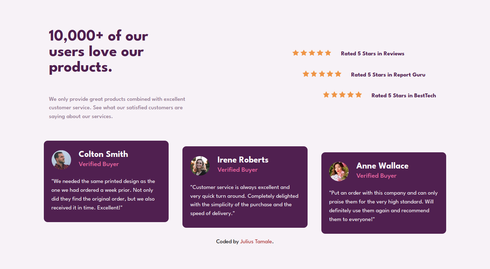

# Frontend Mentor - Social proof section solution

This is a solution to the [Social proof section challenge on Frontend Mentor](https://www.frontendmentor.io/challenges/social-proof-section-6e0qTv_bA). Frontend Mentor challenges help you improve your coding skills by building realistic projects. 

## Table of contents

- [Overview](#overview)
  - [The challenge](#the-challenge)
  - [Screenshot](#screenshot)
  - [Links](#links)
  - [Continued development](#continued-development)
- [Julius Tamale](#author)

## Overview

### The challenge

Users should be able to:

- View the optimal layout for the section depending on their device's screen size

### Screenshot

### Links

- Solution URL: [Source Code here](https://github.com/julius-tamale/social-proof-sections)
- Live Site URL: [Social Proof Live site](https://fm-social-proofs.netlify.app/)

### Continued development
I should continue learning more about CSS Flexbox and CSS Grid to improve my projects layout in future. I'm still struggling especially with CSS Grid.

## Author

- Website - [Julius Tamale](https://julius-tamale.netlify.app)
- Frontend Mentor - [@julius-tamale](https://www.frontendmentor.io/profile/julius-tamale)
- Twitter - [@tjewlius](https://www.twitter.com/tjewlius)